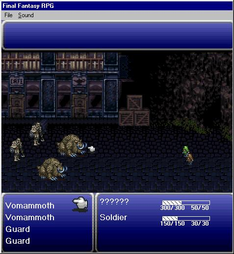



## Final Fantasy RPG

### Description

This is to show a battle system for a RPG. I seen some good code'd ones on this site, but the graphics or styles of it were just sick. So I took some from Final Fantasy 3, and made a complete design of a battle engine.

---

Wow it's been more then a year since I updated this. If you want you can check my new site FoxGear.Net or my own PHP Game at FoxWar.Com.
 
### More Info
 
Attack Screen might be hid from the main form. I should redo the whole thing since I made it 3 years ago and know so much more now. Possibly finally make it so you could walk around and get into a battle :)

             |
---                |---
**Submitted On**   |2001-11-24 10:43:30
**By**             |[$uper\-$tar \(MR\)](https://github.com/Planet-Source-Code/PSCIndex/blob/master/ByAuthor/uper-tar-mr.md)
**Level**          |Advanced
**User Rating**    |4.0 (20 globes from 5 users)
**Compatibility**  |VB 6\.0
**Category**       |[Games](https://github.com/Planet-Source-Code/PSCIndex/blob/master/ByCategory/games__1-38.md)
**World**          |[Visual Basic](https://github.com/Planet-Source-Code/PSCIndex/blob/master/ByWorld/visual-basic.md)
**Archive File**   |[Final\_Fant170411242004\.zip](https://github.com/Planet-Source-Code/uper-tar-mr-final-fantasy-rpg__1-38661/archive/master.zip)

